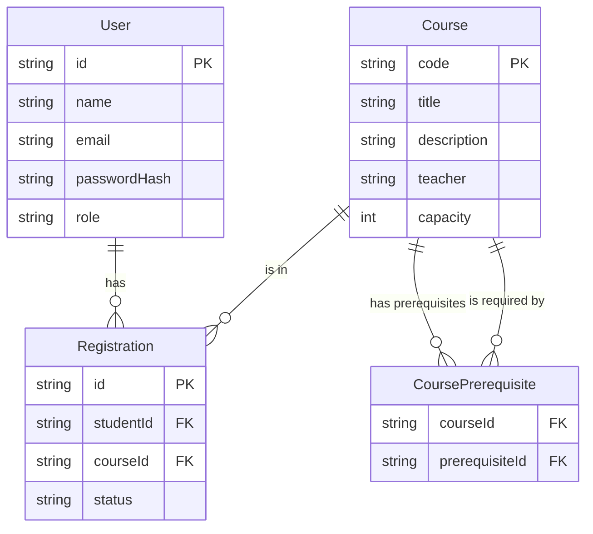

## 📊 Entity Relationship Diagram (Mermaid.js)

```mermaid
erDiagram
  User {
    string id PK
    string name
    string email
    string passwordHash
    string role
  }

  Course {
    string code PK
    string title
    string description
    string teacher
    int capacity
  }

  Registration {
    string id PK
    string studentId FK
    string courseId FK
    string status
  }

  CoursePrerequisite {
    string courseId FK
    string prerequisiteId FK
  }

  User ||--o{ Registration : "has"
  Course ||--o{ Registration : "is in"
  Course ||--o{ CoursePrerequisite : "has prerequisites"
  CoursePrerequisite }o--|| Course : "is required by"
```
  