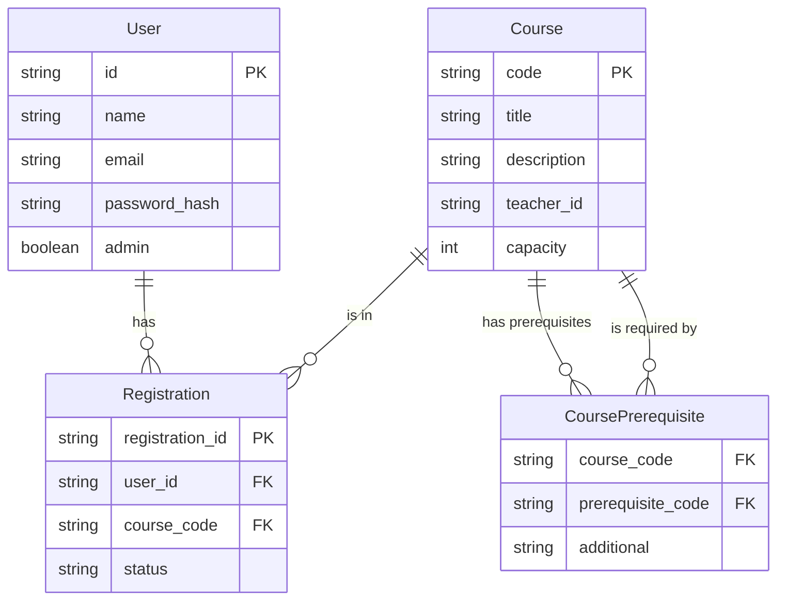
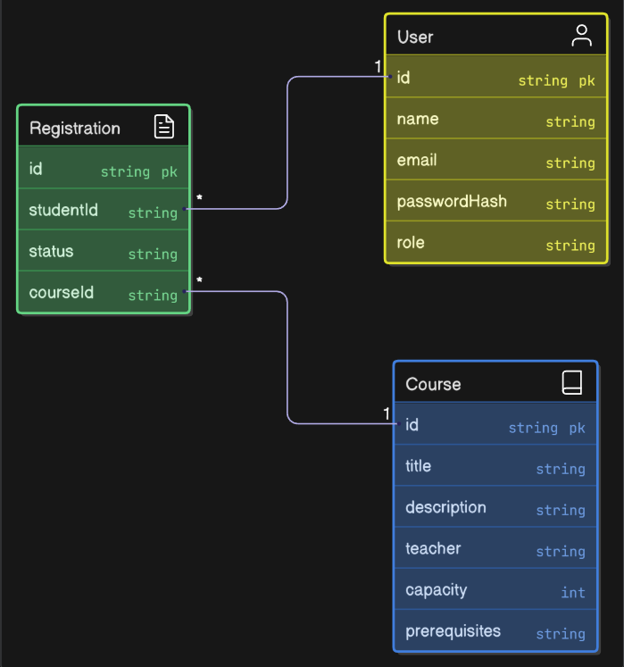

## 📊 Entity Relationship Diagram (Mermaid.js)

```mermaid
erDiagram
  User {
    string id PK
    string name
    string email
    string password_hash
    boolean admin
  }

  Course {
    string code PK
    string title
    string description
    string teacher_id
    int capacity
  }

  Registration {
    string registration_id PK
    string user_id FK
    string course_code FK
    string status
  }

  CoursePrerequisite {
    string course_code FK
    string prerequisite_code FK
    string additional
  }

  User ||--o{ Registration : "has"
  Course ||--o{ Registration : "is in"
  Course ||--o{ CoursePrerequisite : "has prerequisites"
  CoursePrerequisite }o--|| Course : "is required by"
```
  